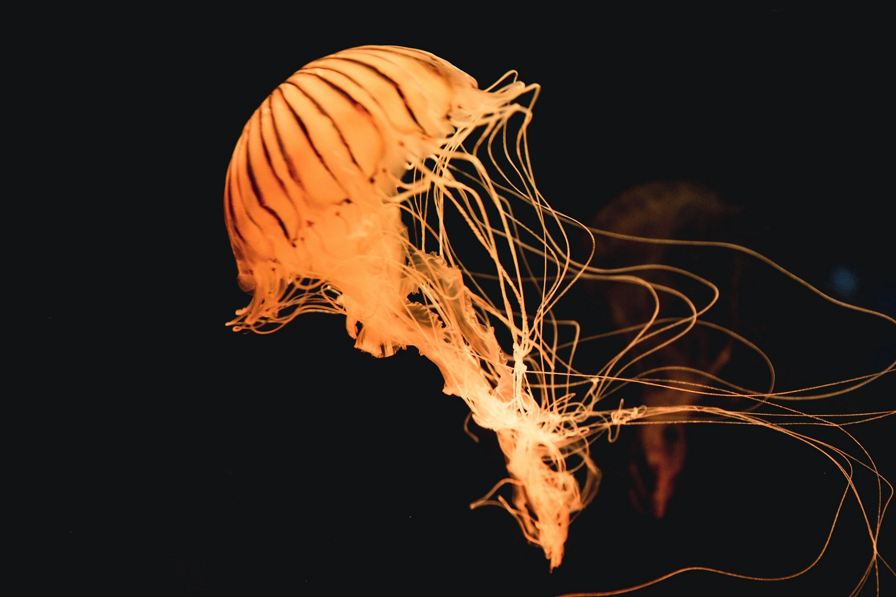

import { Image } from 'astro:assets';
import rocket from '../../assets/images/home/1.webp';

# My MDX Page

// Local image stored in the the same folder

// Local image stored in src/assets/
<Image src={rocket} alt="A rocketship in space." />

